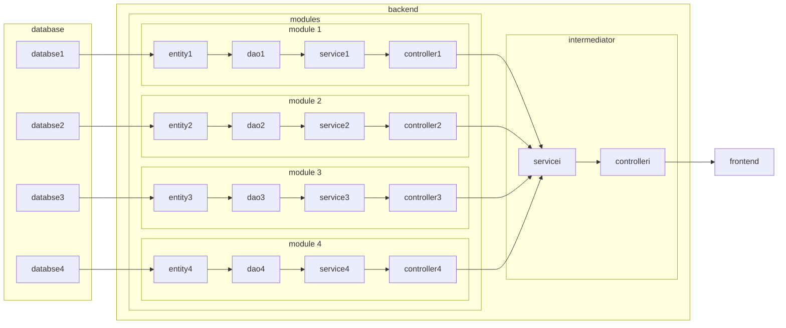
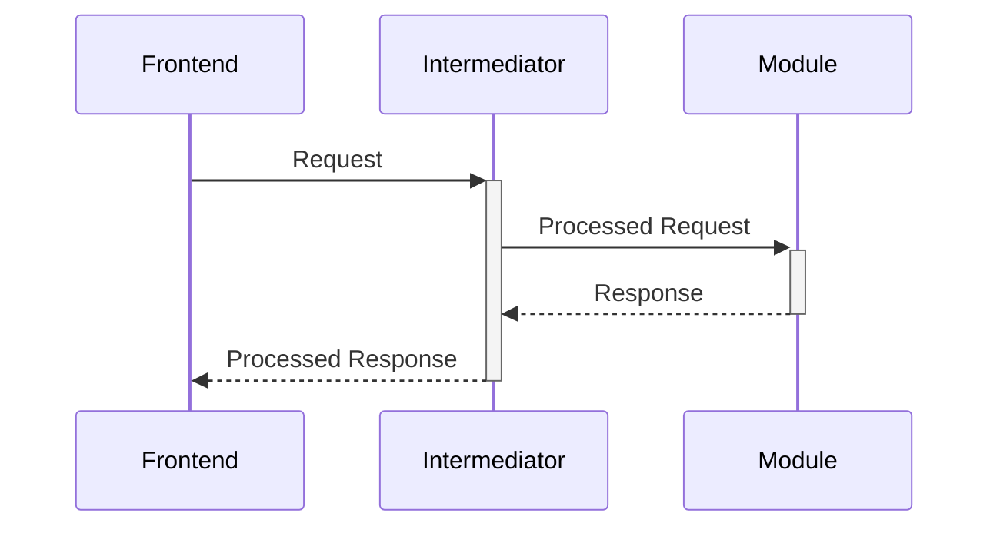
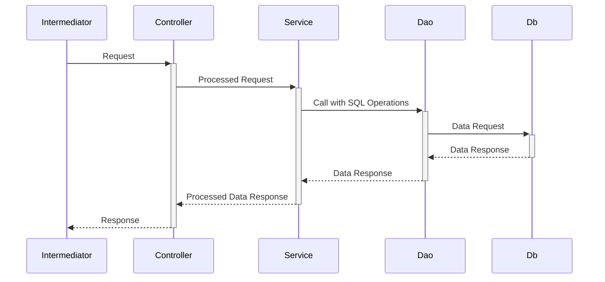

# 虚拟宠物医院后端项目设计文档

## 目录

- [虚拟宠物医院后端项目设计文档](#虚拟宠物医院后端项目设计文档)
  - [目录](#目录)
  - [架构设计](#架构设计)
    - [系统架构图](#系统架构图)
    - [系统调用顺序图](#系统调用顺序图)
  - [数据库设计](#数据库设计)

## 架构设计

### 系统架构图

### 系统调用顺序图

## 数据库设计

- [病例管理与测试模块数据库设计](../medicalRecordManagement/README.md#数据库设计)
- [导览与系统管理、职能学习部分数据库设计](../system/README.md#er图)
- [鉴权模块数据库设计](../login/README.md#数据库设计er图)
