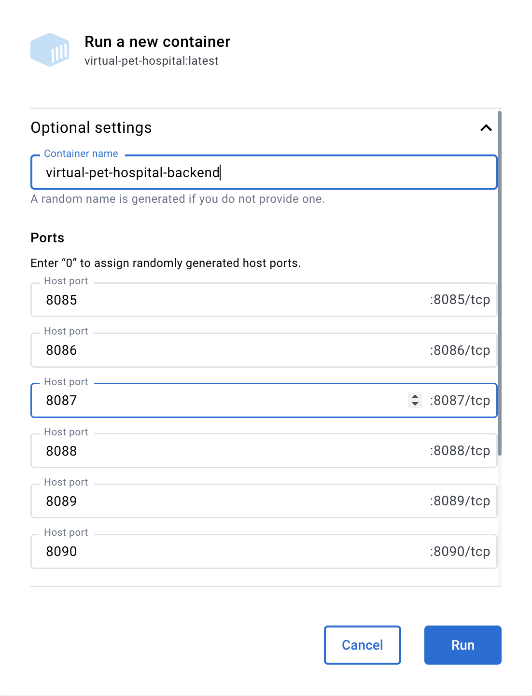

<!--
 * @Author: pikapikapikaori pikapikapi_kaori@icloud.com
 * @Date: 2023-04-19 13:38:14
 * @LastEditors: pikapikapikaori pikapikapi_kaori@icloud.com
 * @LastEditTime: 2023-04-23 15:20:15
 * @FilePath: /结项/部署说明文档.md
 * @Description: 这是默认设置,请设置`customMade`, 打开koroFileHeader查看配置 进行设置: https://github.com/OBKoro1/koro1FileHeader/wiki/%E9%85%8D%E7%BD%
-->
# 虚拟宠物医院后端项目部署说明文档

## 目录

- [虚拟宠物医院后端项目部署说明文档](#虚拟宠物医院后端项目部署说明文档)
  - [目录](#目录)
  - [配置数据库](#配置数据库)
  - [Docker 打包](#docker-打包)

## 配置数据库

1. 使用MySQL数据库（版本：8），数据库需要一个满足以下条件的用户：

   - 权限：All
   - 端口：`3306`
   - 账号：`virtualPetHospital`
   - 密码：`virtualPetHospital`

    SQL:

    ```sql
    DROP USER if EXISTS `virtualPetHospital`;

    CREATE USER `virtualPetHospital`@`localhost` 
        IDENTIFIED WITH mysql_native_password 
        BY 'virtualPetHospital' PASSWORD EXPIRE NEVER;

    GRANT Alter, Alter Routine, Create, Create Routine, Create Temporary Tables, Create User, Create View, Delete, Drop, Event, Execute, File, Grant Option, Index, Insert, Lock Tables, Process, References, Reload, Replication Client, Replication Slave, Select, Show Databases, Show View, Shutdown, Super, Trigger, Update ON *.* TO `virtualPetHospital`@`localhost`;
    ```

2. 初始化数据库：运行`database/createTable.sql`

## Docker 打包

按顺序执行以下命令：

1. 项目下载依赖：

    ```bash
    # Windows
    # .\mvnw.cmd clean install -D skipTests -N
    # .\mvnw.cmd clean install -D skipTests

    # MacOS & Linux
    ./mvnw clean install -D skipTests -N
    ./mvnw clean install -D skipTests
    ```

2. 项目打成jar包：

    ```bash
    # Windows
    # .\mvnw.cmd clean package -D skipTests -P docker

    # MacOS & Linux
    ./mvnw clean package -D skipTests -P docker
    ```

3. docker build：

    ```bash
    docker build -t virtual-pet-hospital .
    ```

4. docker run：

    ```bash
    docker run -p 8085:8085 -p 8086:8086 -p 8087:8087 -p 8088:8088 -p 8089:8089 -p 8090:8090 --name virtual-pet-hospital-backend virtual-pet-hospital
    ```

    或者可以使用Docker Desktop GUI进行配置，具体如下：

    
