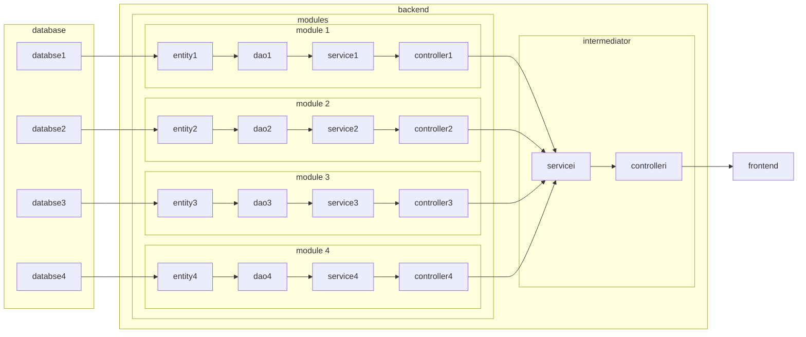
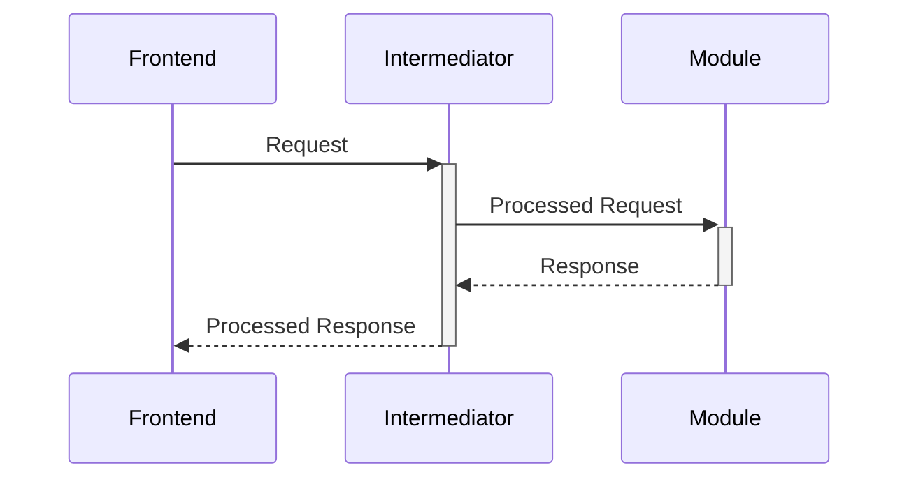
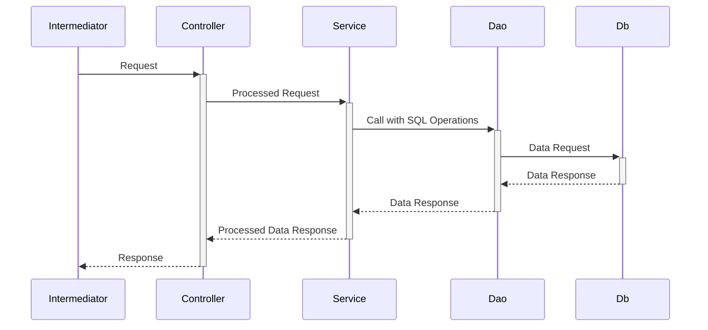

<!--
 * @Author: pikapikapikaori pikapikapi_kaori@icloud.com
 * @Date: 2023-03-17 02:07:30
 * @LastEditors: pikapikapikaori pikapikapi_kaori@icloud.com
 * @LastEditTime: 2023-04-09 23:50:49
 * @FilePath: /virtualPetHospital-backend/docs/ProjectInfo.md
 * @Description: 这是默认设置,请设置`customMade`, 打开koroFileHeader查看配置 进行设置: https://github.com/OBKoro1/koro1FileHeader/wiki/%E9%85%8D%E7%BD%AE
-->
# 虚拟宠物医院后端项目信息

## 架构设计

## 数据库设计

- [病例管理与测试模块数据库设计](../medicalRecordManagement/README.md#数据库设计)
- [导览与系统管理、职能学习部分数据库设计](../system/README.md#er图)
- [鉴权模块数据库设计](../login/README.md#数据库设计er图)

## 项目技术选型

- JAVA 17
- Spring Boot 3.0.3
- Spring Cloud 微服务架构
- MySQL 8.0.32

## 项目结构

- 系统类：
  - eureka: 该文件夹内为Spring cloud所需的Eureka组件，**请勿改动**。其用于项目内各个子模块的注册。
  - jacoco-report: 用于测试报告集成，**请勿改动**。
  - common: 各个子模块共享的工具模块。
- 功能模块：
  - login: 登陆鉴权模块。
  - system: 系统管理模块、导览模块与职能学习部分。
  - medicalRecordManagement: 病例管理模块。
  - exam: 测试模块。
  - intermediator: 中间层模块，后期负责数据转发到前端。
- 其他：
  - database: 用于prod环境初始化数据库与插入数据的sql文件。
  - docs: 项目文档。

## 项目数据库设置

- 端口：`3306`
- 账号：`virtualPetHospital`
- 密码：`virtualPetHospital`
