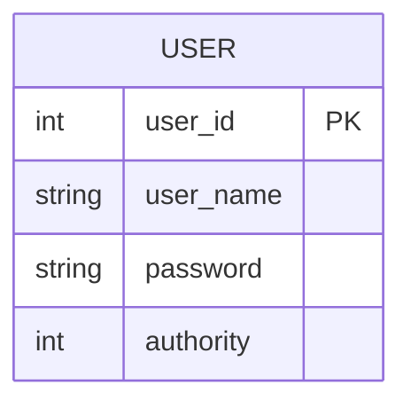

<!--
 * @Author: pikapikapikaori pikapikapi_kaori@icloud.com
 * @Date: 2023-03-13 17:48:09
 * @LastEditors: pikapikapikaori pikapikapi_kaori@icloud.com
 * @LastEditTime: 2023-03-14 16:37:13
 * @FilePath: /virtualPetHospital-backend/login/README.md
 * @Description: 这是默认设置,请设置`customMade`, 打开koroFileHeader查看配置 进行设置: https://github.com/OBKoro1/koro1FileHeader/wiki/%E9%85%8D%E7%BD%AE
-->
# 系统管理模块

## 数据库设计ER图

## 需求

- 用户类型：实习生、老师、管理员
- 登录、注册
- 权限请求
- 职能学习模块的三类角色（兽医师、前台、医助）只限定在模块内部，不参与鉴权
